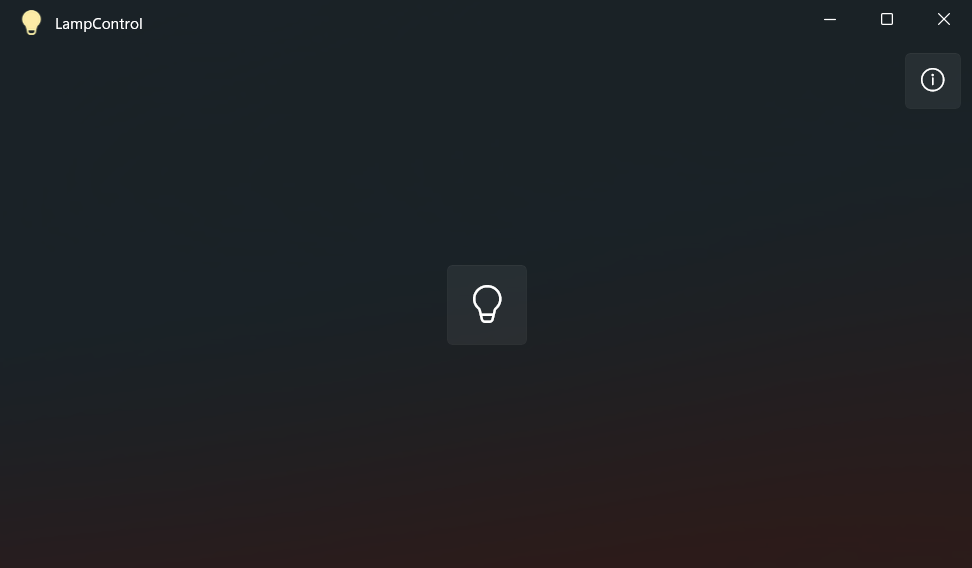

  
  <h1>LampControl</h1>
  <h2>A UWP application using the Lamp API to control the flashlight on a Windows device</a>

## System requirements

- Windows Build 15063 or higher
- ARM32, ARM64, X86, X86_64 based CPU

## Supported devices

| Device             | Supported?|
|--------------------|-----------|
| Surface Duo 1      | ✅        |
| Surface Duo 2      | ❌        |
| Lumia 550          | ✅        |
| Lumia 650          | ✅        |
| Lumia 950          | ✅        |
| Lumia 950XL        | ✅        |
| Non-x50 Lumia      | ❌        |